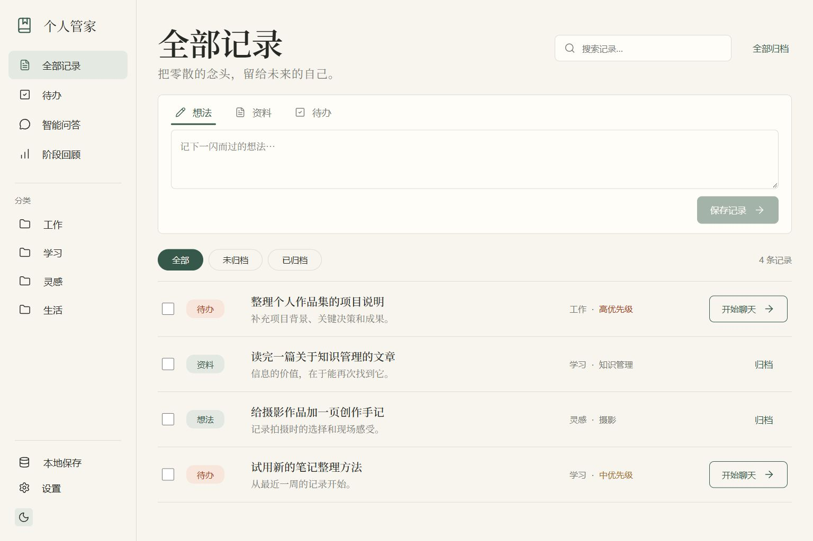

# 个人管家 · Codex 桌面插件

把想法、资料和待办保存在本机，在 Codex 中完成整理、检索和回顾，并从待办打开新聊天。

本机已安装 `personal-steward@ling-local`，版本 `0.1.0`。源码与运行文件位于 `F:\workspace\codex-steward`。

2026-10-02 的改进访谈已整理为 [新版任务看板设计说明](design/个人管家_设计说明_Ling_20261002_需求确认稿.md)：大小卡共用五栏看板，确认验收标准后从小卡启动主聊天。该文档描述下一版需求，当前运行版本仍为 0.1.0。

## 开始使用

1. 完全退出并重新打开 Codex，让桌面端重新发现插件入口。
2. 在左侧查找「个人管家」。插件同时提供聊天内的「记录与待办」入口，也可以在新聊天中输入「打开个人管家」。
3. 切换「想法 / 资料 / 待办」，输入内容并保存。记录无需提前建分类。
4. 待办行的「开始聊天」会携带标题、正文、优先级和工作目录，打开已经填好内容的新聊天；发送后开始执行。完成勾选由你控制。

如果入口未出现，在插件列表确认「个人管家」已启用。当前聊天不会在安装后自动增加工具，使用新聊天加载。桌面原生入口和跳转的实测限制见下文。

## 功能

| 清单要求 | 桌面版本实现 |
| --- | --- |
| 快速记录 | 想法、资料、待办三态输入，原文保留，详情可编辑 |
| AI 归档 | 单条、所选或全部未归档记录；分类、总结、重点、标签、重要度、关联记录 |
| 批量处理 | 可见进度、取消与失败原因；一次最多 1000 条，逐条保存结果 |
| 查找记录 | 关键词、类型、分类、标签、归档状态叠加筛选 |
| 智能问答 | 基于库内原文，可选日期范围，编号引用可打开来源 |
| 待办管理 | 手动录入、AI 提取行动项、优先级、完成勾选、来源链接、开始聊天 |
| 阶段回顾 | 按日期生成关注焦点、进展、重复话题和行动建议；建议可加入待办 |
| 主题 | 浅色纸质 / 深色，响应式布局，尊重减少动态效果设置 |
| 模型选择 | 默认当前 Codex 聊天；可选择自己的 OpenAI 兼容接口 |
| 数据保存 | 本机 JSON、上次有效版本备份、导出与合并导入 |
| Codex 集成 | 官方 MCP Apps 与 MCP Extensions：左侧全局入口和聊天内入口 |

需求清单中的公网分享属于另外的托管场景。本次交付是本机 Codex 插件与仅限本机访问的预览服务，未部署公网服务或发布到公开市场。

## AI 与数据

**当前 Codex 模式**：点击归档、提问或生成回顾后，插件向宿主聊天发送整理请求，由当前模型读取记录并调用插件工具写回结果。无需额外配置 API Key。桌面全局入口按照官方机制关联一个聊天，整理会使用该聊天。

**自选模型模式**：在设置中填 Base URL、模型名和 Key，使用兼容 `/chat/completions` 的服务。Key 尝试保存在该设备的界面 localStorage；宿主若限制持久存储，会提示仅本次打开可用。调用时 Key 会交给本地插件与所选模型服务，不写入 JSON 信息库、导出备份或日志。

原文视为分析资料；归档保留原文，编辑原文会清除失效的归档信息。写回结果校验来源版本，防止旧分析覆盖已修改记录。引用校验范围与记录 ID，仍需结合原文判断模型结论。

- 信息库：`F:\workspace\codex-steward\data\steward.json`
- 上次有效版本：同目录的 `steward.json.bak`
- 手动导出：`data\backups\个人管家_数据备份_日期_标识.json`，界面显示完整路径。
- 导入采用合并：已存在的相同记录不重复添加，同 ID 不同内容会拒绝覆盖；设置和运行中的任务不由导入替换。
- 问答与回顾一次分析原文最多 180,000 字符，超出时缩小日期范围。

## 开发与重新安装

需要 Node.js 22.12+ 或 24，且 `node.exe`、`codex.exe` 可被 PowerShell 找到。在项目目录执行：

```powershell
npm ci
npm run build
npm test
npm run install:codex
```

安装脚本注册本地市场 `ling-local`，启用插件并写入当前项目的绝对路径。移动项目目录后需要重新执行构建与安装。修改后也需重建、重装并重新加载桌面应用。

独立预览：

```powershell
npm start
```

打开 `http://127.0.0.1:43187/`。预览与插件使用同一数据目录。端口可通过 `PORT` 指定；服务只监听 `127.0.0.1`。独立预览中的当前 Codex 模式通过深链接准备新聊天，原生插件内则通过宿主消息桥处理。

`?demo=1` 为只读设计示例，不写入真实信息库。下面的预览图也使用示例记录，实际初始库为空。



## 验收状态

- 自动化检查 14/14：并发保存、损坏文件保护、归档提取与去重、旧原文保护、取消与重叠任务、引用范围、北京时间范围、批量进度、模型错误处理、导入冲突、备份内容、关联索引、聊天链接参数、打包 MCP 入口与 UI、HTTP 请求边界。
- IAB 实际操作通过：录入与编辑、完成筛选、类型/关键词筛选、主题、备份保存与导入、引用跳回原文、回顾行动转待办，以及桌面和小屏布局。
- AI 操作流使用本地模拟模型服务验证，未使用真实供应商的模型或凭证。默认 Codex 模式的原生消息与模型写回尚未在桌面宿主实测。
- CLI 已确认插件安装且启用，MCP 协议已确认 `global` / `thread` 入口注册与 UI 资源可用。**重启后左侧入口实际显示尚未实测**。
- 浏览器安全策略明确拒绝自动打开 `codex://`。聊天链接的工作目录、中文、换行和符号编码已通过测试，**实际桌面跳转需用户在 Codex 中点击验证**。

设计依据、实现差异和减法审查记录在 `design/spec.md`。已保留源码、锁定依赖、构建产物、设计依据和最终预览，临时模型进程已停止。

临时目录的直接递归删除被自动审批执行策略拒绝，已逐文件校验哈希后移入 `F:\workspace\待手动删除\20261001-codex-steward\codex-steward\_work`。其中 12 个文件均为模拟数据、文档缓存和中间截图，可手动删除释放 496,936 字节（约 0.47 MiB）；本次直接释放空间为 0。

## 官方依据

- [OpenAI：插件构建](https://developers.openai.com/plugins/build/plugins)
- [OpenAI：MCP Extensions 与左侧入口](https://developers.openai.com/plugins/build/extensions)
- [OpenAI：插件 UI](https://developers.openai.com/plugins/build/chatgpt-ui)
- [Codex 深链接与命令](https://learn.chatgpt.com/docs/reference/commands)
