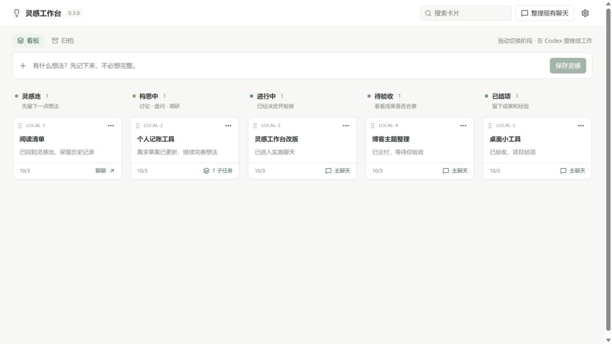
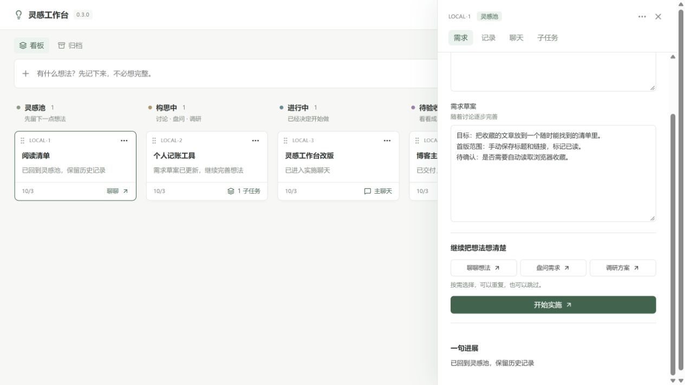

# 灵感工作台 · Codex 桌面插件

把零散想法留下来，选一个慢慢构思，再决定什么时候开始做。看板保存需求、进展和成果，实际讨论与实施沿着原生 Codex 主聊天继续。

当前版本 **0.3.1**。参考 [dashi-taskboard](https://github.com/chuspeeism/dashi-taskboard) 的 SQLite 卡片底座，定制个人构思流程。默认一项想法一张卡，需要分开跟进时再拆一层子任务。

**灵感池 → 构思中 → 进行中 → 待验收 → 已结项**

## 开始试用

1. 本机安装完成后重新打开 Codex，在左侧「灵感工作台」进入；也可以在新聊天输入「打开灵感工作台」。不必先建项目，首页直接写一句灵感并保存。
2. 点开卡片，选择「聊聊想法」「盘问需求」或「调研方案」。盘问使用本机 grill-me，调研使用 idea-research。这些步骤按需选择，可以重复或跳过。
3. 在原生聊天逐渐完善需求，工作流技能将草案、决定和一句进展写回卡片。也可以在详情直接修改「需求草案」或追加记录。
4. 想清楚后点「开始实施」，或把卡片拖到进行中，核对说明再确认。只结束盘问或调研不会送验，开始实施由你决定。
5. 实施聊天保存成果和验证结果后，卡片进入待验收。检查实际成果，将卡片拖到已结项并确认验收。

**本版原生聊天的操作边界：**新聊天预填本轮说明，需要你发送；已有主聊天会复制本轮说明并打开原聊天，需要你粘贴发送。首次发送后，工作流技能读取真实聊天 ID 并关联回来。若当前聊天尚未加载新增 MCP，技能附带的 CLI 可写回同一个本地服务。

原生深链接已经生成并核对参数，实际桌面跳转与完整真实项目交付仍需首轮试用。浏览器自动化不能确认 codex:// 跳转。本版没有通过独立执行器争用原生聊天的写入权。

## 看板操作

- 拖动卡片左上角手柄切换阶段；前进一次一栏，回退可以直接拖到更早的栏。进入实施和结项会打开确认窗口。
- 键盘：聚焦手柄后空格拿起，左右方向键选择栏，Enter 放下，Escape 取消。
- 看板阶段表示项目推进到哪里，执行中、本轮结束、暂时无法读取等表示聊天状态；聊天结束不会自动表示项目完成。
- 卡片详情保留最初想法、需求草案、记录、主聊天和其他关联聊天。编辑目标或回退后，旧回合不能覆盖新阶段和草案。
- 更多操作可归档卡片；归档页可以恢复，原内容、阶段和聊天保留。
- 需要拆分时在更多操作中添加子任务。子任务使用同一套五栏；父卡用于汇总。子任务开始实施后父卡进入进行中，未归档子任务全部结项后父卡待验收，父卡结项仍由你确认。
- 父卡回退先检查并停止自身与子任务主聊天，全部子任务退回构思中，包括此前已验收的子任务；内容、聊天和成果保留。停止失败时保留实际阶段。

## 整理现有聊天

点击顶部「整理现有聊天」，选择 **workspace 及子目录** 或 **所有本机聊天**，勾选后分析。列表显示未归档聊天总数，每页 30 条，可以跨页选择，每批最多 30 个。

AI 建议卡片标题、五阶段、进展、判断理由与角色原文。确认前只保存建议，核对并确认后才建立卡片；一聊天默认一张卡，已有关联时更新该卡。原始说明、已有草案和主聊天保留，来源或目标改变时重新分析。

阶段按项目整体生命周期判断：尚未制作目标产物才属于构思中；已开始制作、存在修订或阻塞、继续盘问下一版都保留进行中。调研报告、小说大纲和设计规范本身也是目标产物，制作这些内容属于实际工作。聊天空闲和一次回答结束不会抹掉已有进展。

0.3.1 增加逐轮时间线，保留头尾截取可能遗漏的中段实施；阶段里程碑逐条核对原文、角色与顺序。小版本发布、阶段性报告或选择方向不表示整个项目送验或结项；完整目标明确交给你最终验收才待验收，用户整体验收后才结项，之后的新修改请求恢复进行中。建议可手动调整，保存时保留你的阶段选择。整理不会接管或启动来源聊天。

## 本地数据与升级

- 新库：data/workbench.sqlite，SQLite 卡片、评论和可选父子关系。
- 首次打开时迁移旧 data/steward.json，单任务项目变为单卡，显式分组与多任务项目保留父子关系；旧标准作为需求草案，资料和结论保存为记录，主聊天和成果保留。
- 旧 JSON 保持原样，额外原文备份在 data/backups/steward-v023-<hash>.json，迁移映射保存在新库。重复打开不会重复导入。
- 设置中的「备份数据」生成可独立打开的 SQLite 快照。需要手动恢复时，先停止本插件服务，再用快照替换新库；恢复不会把原生聊天回滚。
- 回到旧版时使用旧 Git 提交与旧 JSON，并先停止新版服务；不要让两个版本同时使用同一数据目录。原基线为 463c202（0.2.3-dev.2）。
- 如需清空工作台，先停止本插件 HTTP 服务，再运行 `node scripts/reset-workbench.mjs <绝对数据目录> CLEAR_RECORDS`。脚本先生成 SQLite 快照，再清空卡片、归档卡、评论、关联与整理建议；原生聊天和旧 JSON 保留，新库文件不删除，因此重开不会重新迁入旧卡。

0.3.0 的主要入口围绕灵感、构思、实施与验收。0.2.x 的资料归档、引用问答、日期回顾和独立执行器代码仍保留在仓库与历史版本中，本版界面集中在新的工作流。

真实数据、个人研究报告、依赖、构建缓存与临时 QA 文件不提交 Git。以上截图全部使用模拟资料。

## 开发与安装

推荐 Node.js 24、已经登录的 Codex，以及 PATH 中的 node.exe 和 codex.exe：

~~~powershell
npm ci
npm run build
npm test
npm run install:codex
~~~

安装脚本注册本地市场 ling-local，更新 personal-steward@ling-local，写入当前机器的服务路径。移动项目后重新执行；重新打开应用或新聊天以加载新版入口、工具和技能。

~~~powershell
npm start
~~~

本机预览：[http://127.0.0.1:43187/](http://127.0.0.1:43187/)，与插件共用实际数据。服务只监听本机并拒绝跨域访问；端口上的版本或数据目录不符时停止连接。

## 验证与来源

构建成功，自动化检查 **92/92**。0.3.1 增加持续迭代、非代码产物、整体送验与验收、原文角色校验、手动阶段选择，以及清空和快照恢复检查。0.3.0 已完成的隔离界面验证记录保留；本次更新集中在阶段判断和数据重置，没有重新声称完成真实宿主导航与项目交付验证。

只读模型验证：五阶段合成聊天 5/5 符合预期；本次用户反馈的四个真实项目 4/4 判断为进行中，原文引用可核对。真实来源只保存在本机，这些结果不代表任意历史聊天的准确率。

详细设计与试用边界：[0.3.0 实施说明](design/0.3.0/implementation.md)、[首版验证记录](design/0.3.0/verification.md)、[0.3.1 阶段判断与清空验证](design/0.3.1/verification.md)。

复用的五个上游源码文件按 Apache-2.0 保留，固定提交 6a79ef522238ff11681cb85a9d803d19442a3d00；见 [来源说明](vendor/dashi-taskboard/NOTICE.md) 与 [许可证](vendor/dashi-taskboard/LICENSE)。
