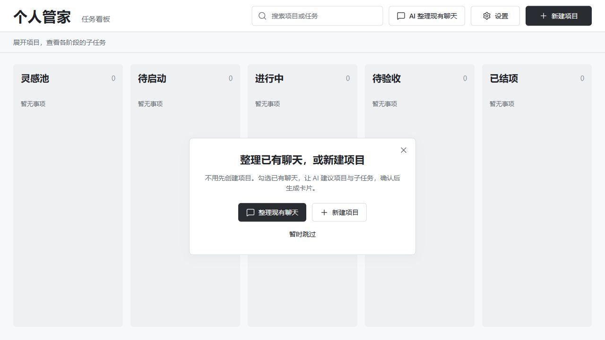
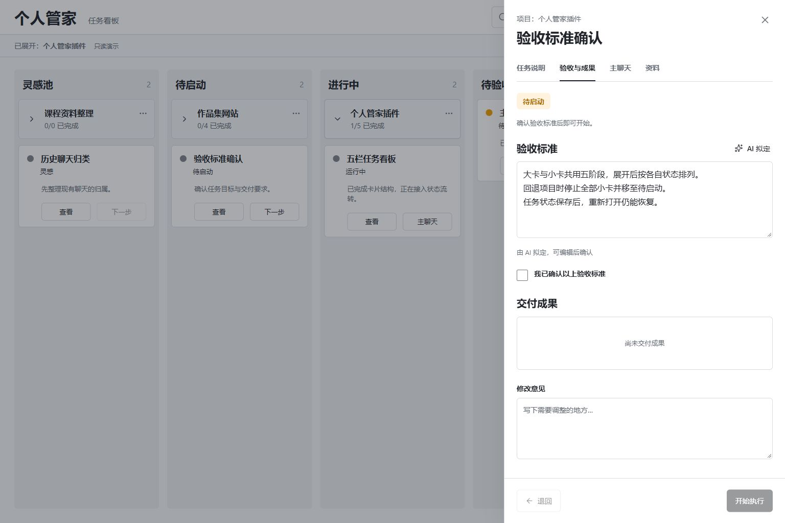

# 个人管家 · Codex 桌面插件

在同一张五栏看板上组织长期项目与子任务，从小卡进入 Codex 主聊天，跟进执行、交付和验收。

当前版本 **0.2.1**。本机已安装并启用 `personal-steward@ling-local`。仓库：[Oblivionis-ling/codex-steward](https://github.com/Oblivionis-ling/codex-steward)，保留 `v0.1.0`、`v0.2.0` 和 `v0.2.1` 版本。



## 使用流程

1. 重新打开 Codex，在左侧「个人管家」入口打开看板；也可以在新聊天输入「打开个人管家」。空看板引导可以点 × 或「暂时跳过」关闭，不必创建大卡。
2. 已有 Codex 任务：点击首页「AI 整理现有聊天」，勾选要整理的聊天，让 AI 建议项目分组和小卡。编辑后点「确认并保存卡片」，同组聊天生成一个大卡和相应小卡，并自动展开。
3. 新目标：新建一个项目大卡，写下长期目标。让 AI 拆分，挑选并编辑建议后创建小卡。
4. 小卡按自己的阶段出现在同一张看板的对应栏。一次只展开一个项目，其他大卡继续显示。
5. 将小卡推进到待启动。检查任务说明，让 AI 拟定验收标准，编辑后勾选确认。
6. 点击「开始执行」，保存的说明和标准直接发送到主聊天；插件内同时打开聊天。首次建立主聊天，返工和后续执行沿用它。
7. 查看卡片的一句进展和实际执行状态。Codex 提交逐条验收证据并结束执行后，小卡进入待验收。
8. 验收通过后结项；需要修改时，在卡片写下意见并发送到原聊天。全部小卡结项后，大卡进入待验收，项目结项由你确认。

聊天整理无需先建项目。列表显示 workspace 中的聊天，每批最多勾选 30 个。可以归入已有项目或小卡；全新分组由 AI 拟定名称，经确认后创建。生成中关闭窗口不会丢失草案，重新点首页入口，在「继续查看整理建议」中恢复。关闭按钮、取消或 Escape 均可退出整理窗口。

五阶段：**灵感池 → 待启动 → 进行中 → 待验收 → 已结项**。运行中、等待回答和失败属于执行状态，不增加看板栏。



## 推进与回退规则

| 操作 | 结果 |
| --- | --- |
| 小卡启动 | 使用已确认的说明和标准；项目自动进入进行中 |
| 普通回复结束 | 留在进行中；没有完整证据不会自动送验 |
| 完整证据 + 真实执行结束 | 小卡进入待验收，精选成果与决定保存为项目资料 |
| 用户通过验收 | 小卡结项；所有小卡结项时项目待验收 |
| 小卡回退 | 先取得停止确认，再回退；保留聊天与已有成果 |
| 大卡回退 | 停止所属执行，**全部小卡回到待启动**，包括灵感、待验收、已结项的小卡 |
| 已结项项目追加需求 | 「重新打开并追加需求」让项目回待启动；历史小卡阶段保留 |

大卡回退会先展示受影响清单。停止过程中其他窗口不能新建或启动该项目的小卡；停止失败会保留实际阶段并显示原因。旧执行结果不能覆盖已回退的阶段。

修改任务说明或验收标准会清除确认。待验收小卡修改目标后回到待启动；已结项小卡须先回退。历史成果保留，当前标准必须有本轮对应证据才可结项。

## 项目内的资料、问答与历史聊天

- 资料来自主聊天提交的精选成果、关键决定和结论，也可手动添加、编辑或移除。移除后保留原文，供历史引用追溯。
- 支持单条、所选批量归档：分类、总结、重点、标签、重要度、关联和行动建议。行动建议经你点击确认后进入灵感小卡。
- 资料可按正文、分类、标签和归档状态查找。首页搜索项目与任务。
- 项目问答和日期回顾结合卡片状态与项目资料，保存可打开原文的编号引用；行动建议经确认后成为小卡。
- 首页「AI 整理现有聊天」或项目详情的历史聊天入口：先勾选，再分析所选正文。AI 建议已有或新项目、小卡归属，确认后生成卡片或关联。没有自动扫描全部聊天。
- 每张小卡一个主聊天，可以添加其他关联聊天；同一聊天不能同时作为多张小卡的主聊天。

默认资料归档由宿主聊天处理。可在设置中选用自己的 OpenAI 兼容模型，这只影响资料归档。任务执行、AI 拆分、标准、问答和回顾使用本机已有 Codex 登录。

## 本地保存与升级

统一工作目录：`F:\workspace`。插件源码与运行文件：`F:\workspace\codex-steward`。

- 数据：`data/steward.json`，写入保留上次版本 `steward.json.bak`。
- 首次迁移 0.1.0 时额外保留 `steward.v1.<原文件哈希>.backup.json`，后续写入不会覆盖它。
- 原记录迁入「原有记录」项目，原待办保持 ID、正文和完成状态。
- 手动导出在 `data/backups/`。备份包含项目、小卡、资料、结论及聊天引用，不含 API Key。
- 导入合并，不覆盖同 ID 冲突，不恢复执行、草案或后台整理任务。恢复后先核对主聊天的实际状态。
- 自选模型 Key 仅保存在本设备的界面存储，调用时交给本机服务与所选模型接口，不写入数据文件、备份或日志。界面存储不可用时仅本次打开可用。
- 任务服务重新连接后，不把旧任务冒充运行中；保留阶段和成果，提示你核对主聊天后继续或回退。

真实数据、依赖、构建产物与临时 QA 文件不提交 Git。截图均为只读设计示例，实际空库会显示创建项目引导。

## 开发、安装与预览

需要 Node.js 22.12+ 或 24、已登录的 Codex，以及 PATH 中的 `node.exe` 和 `codex.exe`：

```powershell
npm ci
npm run build
npm test
npm run install:codex
```

安装脚本注册本地市场 `ling-local`，升级插件并写入本机绝对路径。移动目录后重新执行。当前 Codex 会话不会自动加载新增工具，重新打开应用或使用新聊天刷新。

```powershell
npm start
```

预览：`http://127.0.0.1:43187/`，与插件共用真实数据。只读示例：`http://127.0.0.1:43187/?demo=1`。浏览器预览启动任务时留在看板，可通过链接打开主聊天；桌面插件内启动后由宿主打开聊天。

服务只监听本机、拒绝跨域和 DNS 重绑定。多个 MCP 实例通过共享服务协调执行；默认端口被旧服务占用时会提示版本或数据目录冲突，避免连接错库。请勿用另一端口同时对同一数据目录运行执行服务。

## 验证范围

- 构建通过，自动化检查 **37/37**：原版回归、迁移与原文件备份、并发启动与项目回退、验收证据和过期写回、历史范围、引用版本、导入冲突、App Server 请求与中断、打包 MCP 与 HTTP 边界。0.2.1 新增空库归类、同组大卡、既有小卡关联与停止锁、缺少项目的类型限制、多窗口归类防重验证。
- IAB 验证：创建、拆分编辑、标准确认、启动送验与返工、全量回退、批量归档与建议确认、资料搜索和编辑、引用打开、历史聊天归属、备份保存与合并。桌面 1536×1024、默认 1280×720、小屏 390×844及深色主题均检查。
- 0.2.1 IAB 补充验证：引导关闭与刷新、空库首页归类、关闭生成窗口后恢复草案、编辑建议并创建大卡/小卡、未选聊天不入卡、空列表与连接失败重试、搜索失焦后的 Escape 退出；1280×720、900×720、390×844 的入口布局已检查。
- 0.2.0 已通过真实 App Server 验证现有 ChatGPT 登录、workspace 聊天读取和一个 ephemeral 只读结构化模型回合，两个独立 MCP 客户端共享同一服务并发保存已验证。0.2.1 已确认本机服务版本与真实 data 目录。
- 完整任务执行、送验、返工和回退的界面闭环使用隔离的协议模拟验证；**尚未用真实模型完成一个完整项目交付闭环**。
- CLI 已确认 0.2.1 安装启用，MCP 已确认 global/thread 入口和独立 UI 资源。**重开桌面后侧栏实际显示、主聊天导航及宿主资料归档写回仍待桌面实测**。浏览器策略拒绝自动打开 `codex://`，本轮没有绕过该限制。
- App Server 使用已有登录及权限设置；插件展示原生问题与权限请求，用户明确回答后才提交。本版不自动批准权限。

本轮入口修正与使用步骤：[0.2.1 验证记录](design/0.2.1/verification.md)。设计依据：[需求确认稿](design/个人管家_设计说明_Ling_20261002_需求确认稿.md)。五栏实现与截图对照：[0.2.0 验证记录](design/0.2.0/verification.md)。0.1.0 的设计留在 [历史说明](design/spec.md)。

## 官方接口依据

- [Codex App Server](https://developers.openai.com/codex/app-server)
- [插件与左侧入口](https://developers.openai.com/plugins/build/extensions)
- [MCP Apps UI](https://developers.openai.com/plugins/build/chatgpt-ui)
- [Codex 深链接](https://learn.chatgpt.com/docs/reference/commands)
