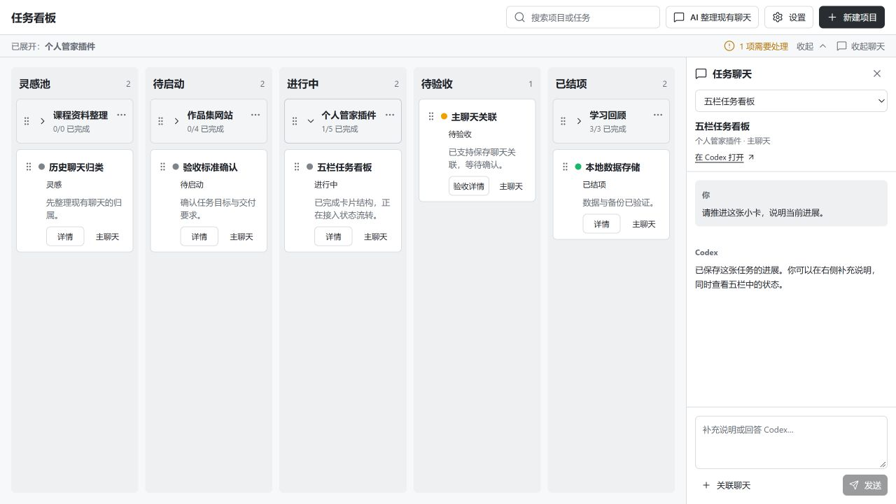

# 个人管家 0.2.2 修改与验证

日期：2026-10-02。基于已经上传的 `v0.2.1`（提交 `3486540b697201949c1609d57b28afbf800a6a0f`）制作；旧标签与提交保留。

## 对应反馈

- 移除原 30px「个人管家」大标题，改为 16px 的紧凑「任务看板」标签。压缩顶部操作区，默认 1280×720 窗口中，看板从 y=82px 开始。
- 卡片标题统一 13px，阶段栏标题 15px，执行状态 11px；减少内边距与按钮尺寸。
- 主聊天从详情抽屉移到独立区域：宽窗口右侧 300px，960px 及以下上下排列。支持切换小卡、收起、查看消息、发送说明、关联其他聊天和打开原生聊天。草稿按小卡保存在本机，Ctrl+Enter 发送，长消息折叠后可展开全文。
- 阶段推进和回退改为拖拽手柄；保留验收标准确认、继续执行与带修改意见返工等业务操作。目标栏显示移动结果，跨阶段跳跃会被拒绝。也支持空格拿起、方向键选栏、回车放下、Escape 取消。
- 拖入进行中使用保存的说明和已确认标准，随后显示独立主聊天。标准未确认先打开设置，不会执行。待验收拖入已结项先展示证据，确认后才保存；进行中送验仍由完整证据和真实执行结束触发。
- 大卡向前一栏拖动先展示影响清单，确认后停止所属执行，所有阶段的小卡统一回待启动。聊天与已有成果保留；多窗口导致卡片阶段改变时，旧拖动操作被拒绝。
- 嵌入模式使用官方 HostContext 的安全区域；全屏至少预留 76px 底部空间，inline 模式遵从宿主值。看板、详情抽屉、弹窗和提示均避开该区域。小屏聊天保证输入和发送可达；低高度窗口可滚动整个上下布局。

## 聊天漏项修复

真实 App Server 的 `thread/list` 直接使用 `cwd: F:\workspace` 时只返回 5 条；不加目录筛选并读取全部标题元数据分页，实际返回同目录的聊天有 7 条。旧目录索引与返回的修复元数据不一致。

新版读取全部元数据分页，按返回的 cwd 核对 workspace。目录比较兼容大小写、斜杠和尾斜杠，包含 CLI、VS Code、App Server 和未知来源；排除 ephemeral、已归档聊天和其他项目目录。选中前不会读取聊天正文。

界面显示总数量、已选数量、刷新和加载更多；分页使用稳定快照，最长保留 30 分钟，超过后提示刷新。英文标题搜索忽略大小写；搜索、分页和刷新保持所选聊天。插件自己生成的整理、拆分等辅助聊天默认隐藏，可勾选「显示整理辅助聊天」查看。

2026-10-02 最终真实接口核对：普通聊天 **6 条**，隐藏辅助聊天 **1 条**，打开辅助开关共 **7 条**。本轮未让模型整理这些真实聊天，也未改写其卡片数据。

## 验证结果

- `npm run build` 成功；最终打包产物的 `npm test` **41/41** 通过，包括 HTTP/MCP、迁移、备份、验收证据、并发启动与项目回退等已有检查，以及本轮分页、目录漏项、稳定快照、过期拖动和辅助开关检查。
- `npm ci --ignore-scripts --dry-run` 通过。锁文件修正原版本对 forwarded 和 ip-address 依赖版本的误改，保留原依赖解析信息；旧版本历史未重写。
- 隔离 MockCodex + IAB：鼠标实际拖动灵感小卡到待启动；键盘回退；指针和键盘 Escape 取消；标准未确认不会执行；确认后拖入进行中显示主聊天并可发送说明。
- 隔离验证待验收拖入已结项，取消保留阶段，确认才结项；大卡回退后 5 张小卡全部待启动。未用用户真实项目进行这些操作。
- 44 条模拟聊天完整分页到 44/44，最后一项可勾选；搜索后保持跨页所选，避免只处理首屏。
- 1280×720、900×720、390×844、375×812、844×390 和深色主题检查通过。900px 与手机宽度发送栏完整可见；横屏低高度窗口可以滚动到发送栏。最终控制台无 warn/error。
- 官方 AppBridge 隔离宿主设定 `safeAreaInsets.bottom=96`：720px 高窗口的抽屉和 footer 底部均为 y=624，聊天选择窗口为 y=24–600；没有侵入预留区域。
- CLI 核对 `personal-steward@ling-local` **0.2.2 installed/enabled**；本机 `43187` 服务版本 0.2.2，数据目录为项目真实 `data/`。HTTP 界面每次读取最终构建文件。

浅色、深色与手机预览分别为 [dashboard.png](dashboard.png)、[dark.png](dark.png)、[mobile.png](mobile.png)，均为模拟资料。

## 实际边界与减法审查

外层标题与原生输入框由 Codex 宿主管理，当前官方接口没有隐藏外层标题或移动原生输入框的能力。本轮修改插件内部标题、独立聊天区和安全空间；宿主安全区域验证使用官方 SDK 的隔离模拟，不冒充完整桌面实测。重开桌面后的实际布局、原生主聊天导航及宿主归档写回仍待桌面实测；尚未用真实模型完成一个完整项目交付闭环。

本版继续服务于「从待办进入 Codex，持续查看执行进展」。删除重复大标题、详情里的聊天页和阶段按钮，简化为紧凑五栏与独立聊天；保留验收确认和实际停止边界即可，不增加新的卡片层级、统计仪表盘或后台自动归类。

保留源码、测试、安装脚本、运行文件、真实数据、三张最终示例截图和本记录。用户反馈截图仅存放于被 Git 忽略的本机 `data/feedback/0.2.2/`，不提交公开仓库；临时 QA 清理结果见工作空间索引。

本轮 QA 服务和两个浏览器标签已关闭，viewport 已恢复。直接删除 `_work/` 被自动审批以 `blocked by policy` 拒绝，93 个临时文件共 3,418,234 字节（约 3.26 MiB）已按原路径移至 `F:\workspace\待手动删除\20261002-codex-steward-0.2.2\codex-steward\_work\`，可手动删除；本次实际释放空间 0。移动哈希 93/93 一致，清理前后三张图片、验证记录、三个运行文件和真实数据文件的哈希 8/8 一致。项目内无残留 `_work`；其他项目与旧待删除目录未处理。本机详细盘点在 `data/feedback/0.2.2/cleanup-audit.json`。
