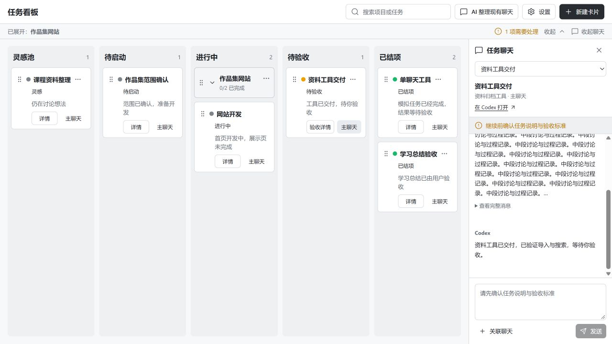
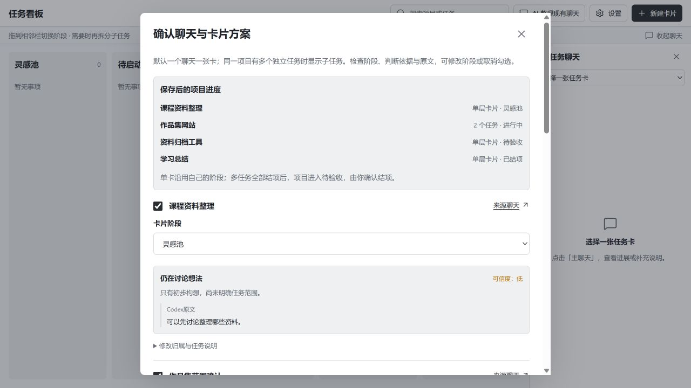
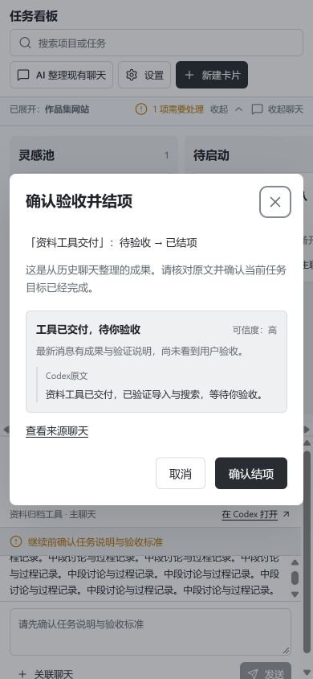

# 0.2.3-dev.2 · 单层卡与聊天进度

用户确认：默认单层卡，需要时再拆子任务。主要场景是一项项目在一个 Codex 聊天中完成；卡片帮助进入聊天、查看进度并验收，层级只在确有多个任务时出现。

## 卡片与五阶段

- 五栏仍为灵感池、待启动、进行中、待验收、已结项。执行状态继续单独显示。
- 新建入口直接创建一张可执行任务卡。项目和任务一次保存，避免先建空项目才能继续。
- 保留原有项目/任务存储和 ID，默认 `layout: auto`。只有一个任务时显示该任务卡，项目阶段跟随任务；单次验收即可结项，重新打开时一起回待启动并保留聊天和成果。
- 添加或拆分子任务后显示项目与子任务；原任务、主聊天、标准、进度和资料保留。现有显式 `layout: group` 项目继续按原层级显示。
- 子任务开始后项目进入进行中，全部结项后项目进入待验收，项目结项由用户确认。回退沿用先确认实际停止、全部子任务回待启动的规则。
- 任务卡 ⋯ 和详情仍能进入项目管理、资料、问答及拆分。新建子任务后展开正确项目并打开新任务。

## 历史聊天进度

先选择聊天再分析。AI 为每个聊天提出归属、任务阶段、一句进展、理由、置信度和带角色/回合标识的原文引用；同时预览项目汇总阶段。单聊天默认一张卡，多聊天同组才产生层级。

分析材料保留最初目标和最新尾部，额外提供最新消息的角色与摘要；最后一条过长也不会让旧成果遮住后续新需求。引用必须能在所选原文中核对。仍在执行的来源保持进行中，仅有助手自称完成最多建议待验收；无依据时保守判断并标低置信度。

保存需用户明确确认阶段判断。编辑建议后重新确认；保存前核对完整来源哈希及目标卡/项目快照，来源或目标改变则拒绝过期建议。已有卡的说明、标准和主聊天保留；同一主聊天不重复建卡，同一目标不接受多个竞争进度来源。保存不启动真实执行、不虚构运行记录或验收标准。

历史导入的待验收卡可用原文证据结项，确认时重新核对来源、当前任务以及来源/主聊天是否仍在执行。目标编辑、回退或重新执行会撤销历史验收资格。导入进行中的卡回退时必须取得来源聊天的实际停止确认；失败保留原阶段。历史卡要继续执行时先补充并确认标准。

## 验证

- 自动化检查 67/67，包含单卡创建、布局、验收和重开、长聊天最新需求、引用角色与原文、确认和过期保护、已有元数据保留、去重、项目汇总、历史验收及失效、来源停止失败。
- 真实 Codex 只读 ephemeral 模型回合只处理五份合成聊天，五阶段 5/5 与预期一致，引用均可核对；包含旧交付之后追加未完成需求的长聊天。结果见 [model-progress-check.json](model-progress-check.json)，只代表这组用例。
- 隔离 MockCodex + IAB 验证直接创建、标准确认、启动送验、取消/确认验收、恢复历史草案、进度编辑与再次确认、历史导入及验收、重开/拆分保留主聊天、新建子任务正确展开。
- 1280×720 五栏 `clientWidth === scrollWidth`；390×844 历史验收弹窗可完整操作；最终控制台警告/错误均为 0。
- 未对用户真实聊天执行归类或启动任务。完整真实模型项目交付闭环、重新打开 Codex 后的宿主布局与原生导航仍待实测；浏览器拒绝自动打开 `codex://` 时未绕过限制。

最终构建已安装为 `0.2.3-dev.2`：安装缓存 MCP/HTTP/UI 三个文件的 SHA-256 均与构建一致，43187 正式服务加载时间晚于最后构建，服务返回的 UI 字节哈希也一致。真实库的 4 个项目、4 个任务、资料和结论与本轮安装核验备份相同；没有运行中执行、待答请求或整理作业。备份时已有 dev.2 默认字段，此处验证安装未改变业务数据，不将它当作最初 dev.1 原始备份。

安装与真实数据核验记录保存在本机被 Git 忽略的 `data/feedback/0.2.3-dev.2/`。真实数据、用户反馈和临时 QA 资料不进入公开仓库。

## 界面证据

下图均为隔离模拟资料。历史截图展示整理建议，真实保存以用户确认和来源核验为准。

## 减法审查

实际目标是从事项进入 Codex 并查看执行进展。本轮删除默认重复出现的项目大卡和必须先建项目的步骤，归类窗口优先呈现阶段/证据，归属和说明折叠。保留原存储以兼容旧数据，只有需要拆分时展示层级；无需新增阶段、扫描全部聊天或自动执行任务。

本轮以 `0.2.3-dev.2` 继续开发，不打最终 `v0.2.3` 标签。
