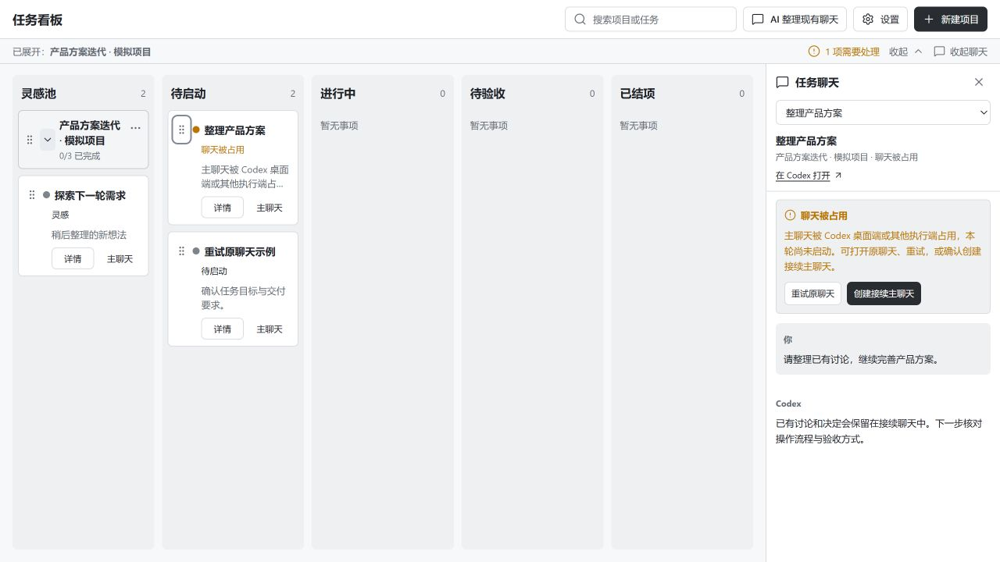
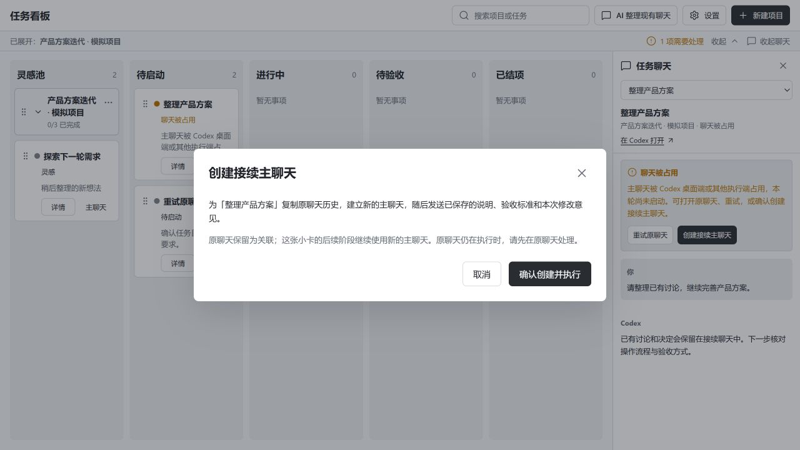

# 个人管家 0.2.3：主聊天占用恢复

本轮是 0.2.3 的一个改动项，以 **0.2.3-dev.1** 安装和提交，保留既有版本标签；0.2.3 后续改动继续迭代。

## 问题与原因

用户启动已有聊天对应的小卡时，收到 `thread … already has an active writer`，界面显示执行失败和内部聊天 ID。

插件使用独立 Codex App Server，桌面端使用自己的执行连接。已有聊天虽然最后一轮已结束，桌面端仍可能持有它的 writer；插件调用 `thread/resume` 被拒绝，尚未发送本轮任务。这与“模型正在执行”需要分别处理。

依据官方 [Codex App Server](https://developers.openai.com/codex/app-server) 和本机 0.159.2 协议核验：`thread/resume` 没有强制接管参数；`thread/fork` 支持通过指定已结束回合复制历史；`thread/unsubscribe` 可以卸载本连接的闲置聊天。当前桌面环境没有核验到可用的共享 writer 连接。

## 修复后的操作

1. 小卡启动遇到占用时显示「聊天被占用」，保留原阶段、已确认说明与标准、旧成果、历史执行字段和返工意见。项目大卡也不会因这次失败而推进。
2. 打开小卡「主聊天」：右侧显示中文原因与原聊天消息，可「在 Codex 打开」或「重试原聊天」。占用响应不会出现“任务已发送”的成功提示，未发出的补充说明仍保留。
3. 写入权冲突时提供「创建接续主聊天」，先明确展示历史复制、主聊天变化和原聊天保留规则。取消、关闭和 Escape 都不会创建聊天。
4. 确认后通过官方 `thread/fork` 建立接续聊天，保留历史，把原主聊天加入关联，然后发送保存的任务说明、标准和返工意见；后续阶段沿用新的主聊天。
5. 原聊天或其最后一轮仍在执行时，接续会被阻止。原主聊天、标准或占用状态变化时，旧确认会被拒绝。并发确认只建立一个接续并执行一次。
6. 接续传入 `deferGoalContinuation: true`，由明确发送的本轮任务开始执行，避免复制已有目标时立即产生额外自动执行。
7. 本插件执行真实结束后，释放自己持有的闲置聊天；运行中和准备启动时保留连接，下一轮恢复等待上一次卸载完成。

旧版本无实际执行回合的 writer 失败，在启动服务时迁为占用状态，不自动重发任务。修改目标或回退时清除旧的待发请求，备份导入也不恢复它。

## 验证

- 最终构建成功，自动化检查 **50/50**。覆盖原有回归、writer 错误映射、原阶段与验收成果保护、返工意见重试、并发接续防重、历史与关联保留、过期确认和执行中保护、旧失败迁移、导入清除待发请求、闲置 writer 释放、卸载与恢复顺序、结束早于启动回复的竞态。
- 隔离 MockCodex + IAB：从待启动键盘移动到进行中，冲突时仍留待启动并自动打开主聊天；取消后模拟执行和 fork 数均为 0。确认后新主聊天沿用历史，原聊天保留为关联，状态显示已发送。另一小卡的占用解除后重试沿用原聊天；最终模拟执行 2 次、fork 1 次。
- 1280×720 与 390×844 检查；窄窗口的恢复按钮与确认弹窗可见、可操作。控制台警告和错误均为 0。小屏证据为 [确认弹窗](continuation-mobile.jpg)。
- 本机真实协议：桌面原聊天空闲，最后一轮 `completed`，独立 App Server 恢复得到 `CHAT_BUSY/writer`。已核对来源没有目标自动续行，使用只读 ephemeral fork 验证接续成功且来源匹配，然后 `thread/unsubscribe` 返回 `unsubscribed`。**全程没有发送 `turn/start`，没有执行用户真实任务。**
- 本机安装启用 `personal-steward@ling-local` 0.2.3-dev.1；安装缓存的 MCP、HTTP、UI 文件与最终构建的哈希 3/3 一致。`43187` 服务版本与真实 `data/` 路径已核对。
- 截图中的真实小卡已从失败迁为 `blocked`，仍为待启动、`turnId: null`，原主聊天保持。升级前后所有持久业务字段核对一致，允许的变化仅是该小卡的占用状态、中文提示、未启动的 runId 和更新时间。

## 验证边界与减法审查

实际模型完整项目交付闭环，以及重开 Codex 后的宿主页面刷新与原生导航仍待用户实测。只读临时 fork 的协议验证不等于已经在真实接续聊天完成一次模型任务。

五栏和既有推进、回退、验收规则继续沿用。这项改动只加入占用识别、重试、明确确认的历史接续和本插件闲置连接释放；用户保留主聊天变化与执行时机的控制权。

用户反馈图与升级前数据副本仅在被 Git 忽略的 `data/feedback/0.2.3/` 保留，公开仓库的截图均为模拟项目。本轮临时 QA 清理见工作空间索引。

本轮隔离 QA 服务、两个临时浏览器标签已关闭，viewport 已恢复。递归删除 `_work/` 被自动审批以 `blocked by policy` 拒绝，已按原路径移动至 `F:\workspace\待手动删除\20261002-codex-steward-0.2.3\codex-steward\_work\`，目录当前为 560 个文件、7,222,059 字节（约 6.89 MiB），可手动删除。原盘点为 561 个文件；其中一次性服务刷新脚本在移动后先被拒绝读取，随后复查未找到，原因未确认，其余 560/560 移动哈希一致。保留源码、真实数据、截图和运行文件的核验哈希 72/72 一致；未调整文件权限或重建该脚本。项目内无残留 `_work`，本轮未主动删除释放空间。详细原始盘点及异常记录在本机 `data/feedback/0.2.3/cleanup-audit.json`；其他项目和旧待删除目录保持原样。
